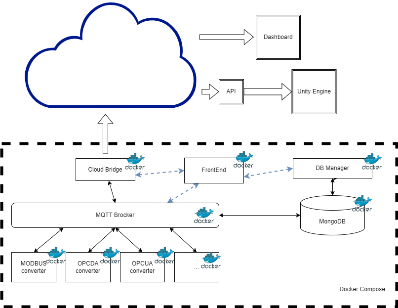

# vTwinPack_Framework for IoT and Virtual Commissioning

This framework is intended to provide a functional solution to gather field data from industrial devices and route it to a local MQTT broker, a MongoDB database and a Unity virtual enviromente.

Framework code is in the mainCode directory.

This code it's composed by:
- "dataTomqttExtrator" - gathering data from multiple data sources and publishing it to a MQTT broker. Currently suportting:
  - Modbus TCP
  - OPC-DA
- "twinAPI" - an API that bridges data to be accessible to the UNITY application.
- "unityPJ" - a sample of a Unity project that can ingest data from the API.
- "dataManager" - sending data from the MQTT broker to the MongoDB database.
- "MondoDB database" - to store the last state of the MQTT broker and all the changes to the data.
- "Mosquitto" - the MQTT Broker
- "frontEnd" - used to serve the MQTT broker content in a webpage.