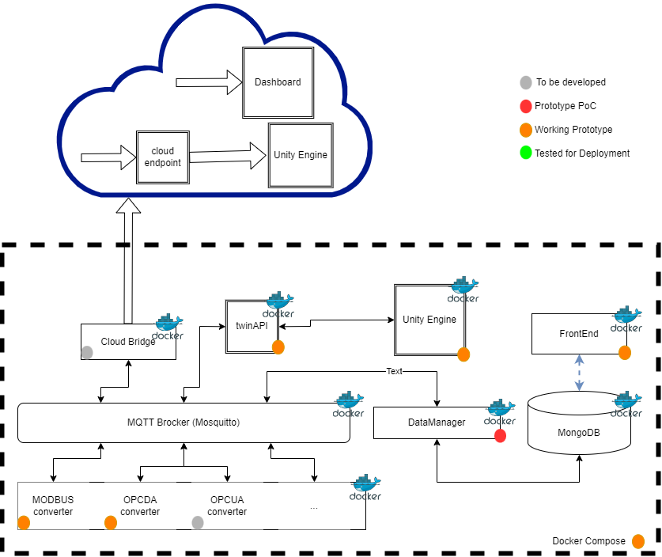
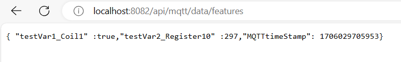
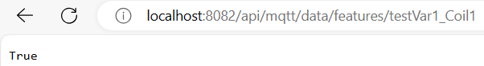
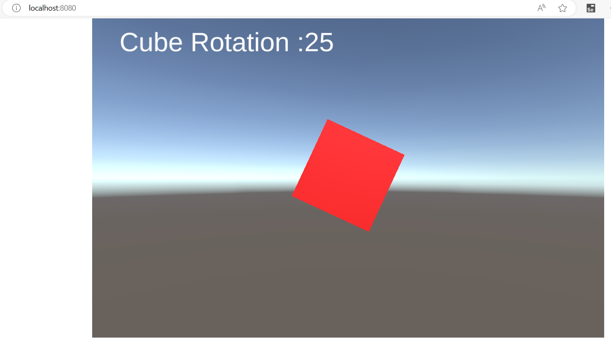

# vTwinPack_Framework for IoT and Virtual Commissioning

This framework is intended to provide a functional solution to gather field data from industrial devices and route it to a local MQTT broker, a MongoDB database and a Unity virtual enviromente.

## Framework code is in the "mainCode" directory.

## Currently available services are:

- "dataTomqttExtrator" - gathering data from multiple data sources and publishing it to a MQTT broker. Currently suportting:
  - Modbus TCP
  - OPC-DA
- "twinAPI" - an API that bridges data to be accessible to the UNITY application.
- "unityPJ" - a sample of a Unity project that can ingest data from the API.
- "dataManager" - sending data from the MQTT broker to the MongoDB database.
- "MondoDB database" - to store the last state of the MQTT broker and all the changes to the data.
- "Mosquitto" - the MQTT Broker
- "frontEnd" - used to serve the MQTT broker content in a webpage.

### FrontEnd: 

### TwinAPI:

### Unity:

## Requiremensts and setup:

- Install docker.
  - Sample Modbus server code for test is avalable in the "oldTests/modbusServer" directory: modbusSampleServer.py.

- Run "dockerBuild.bat" to deploy localy.

  - standard "frontEnd" address: http://localhost:3000/webpage
  - standard "twinAPI" address:
   - all feature data: http://localhost:8082/api/mqtt/data/features
   - test boolean data: http://localhost:8082/api/mqtt/data/features/testVar1_Coil1
   - test numeric data: http://localhost:8082/api/mqtt/data/features/testVar2_Register10
  - standard "mosquitto" address: localhost:1884
  - standard "mongoDB" address: localhost:27016
  - standard "unityPJ" address: http://localhost:8080

- Run "dockerKill.bat" to clean the deployment.

## Notes:

more info on virtual comissioning, check:
 - https://github.com/LuisCMoreira/The_IoT_VirtualRobot/tree/master

for any question contact me on:
 - www.linkedin.com/in/luis-moreira-34724384
